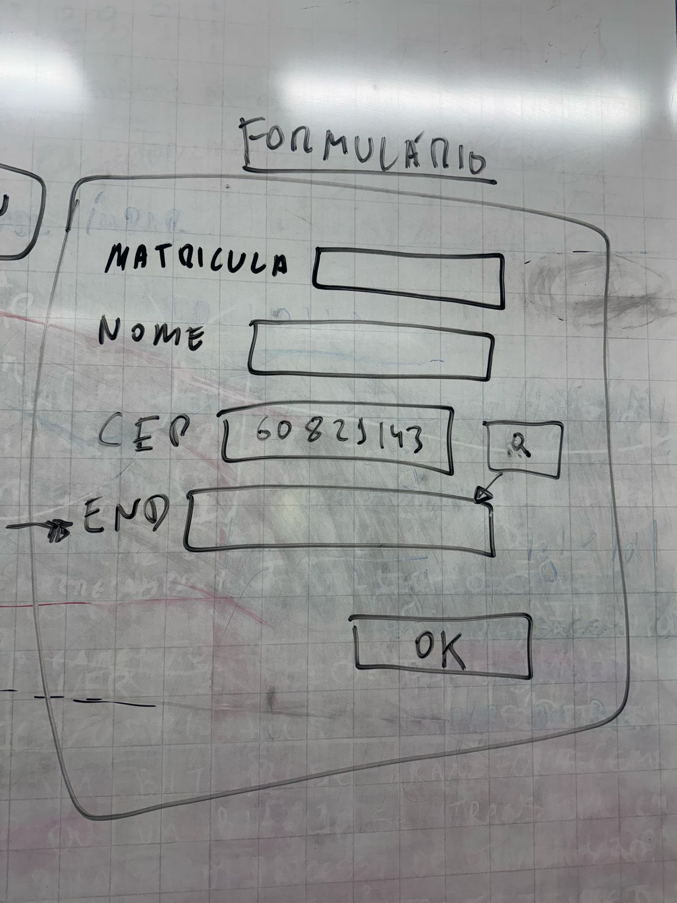

# Atividade 01 - Formulário Web

> **Feito Individualmente**

Crie um formulário web conforme a imagem anexa.

O formulário deve utilizar o serviço viacep para recuperar o endereço da pessoa a partir do cep informado.

Quando for apertado o botão "OK" no final do formulário todos os campos devem ser validados e ser dado um alerta, caso algum campo não esteja preenchido ou tenha menos que 3 caracteres.

